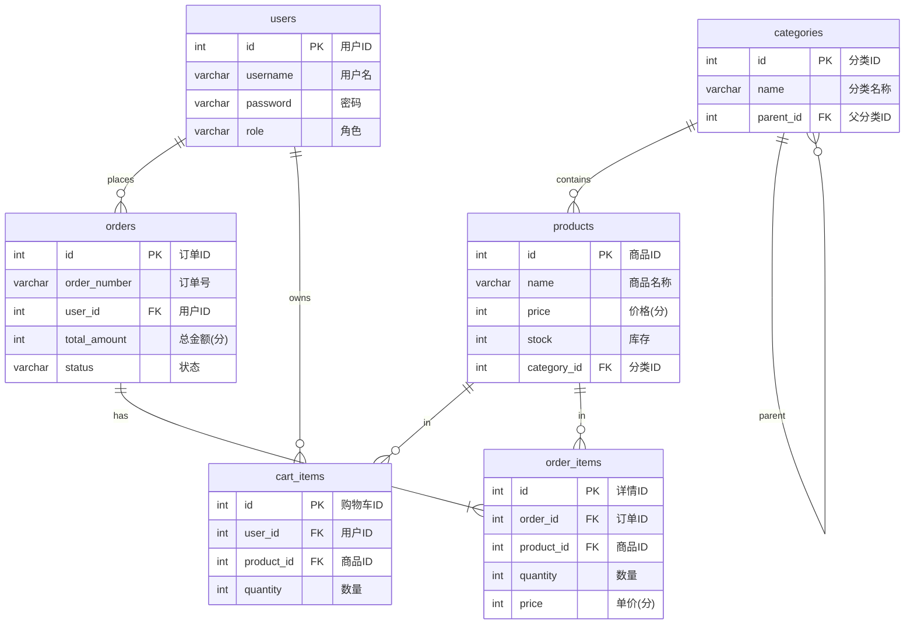

https://mermaid.live/

时序图
sequenceDiagram
    participant User as 用户 (Client)
    participant Controller as OrderController
    participant Service as OrderService
    participant ProductService as ProductService
    participant Repo as OrderRepository
    participant DB as Database

    User->>Controller: POST /api/orders (下单请求)
    activate Controller
    Controller->>Service: createOrder(userId, address)
    activate Service
    
    Note over Service: @Transactional 开启事务

    Service->>DB: 查询用户购物车项 (cartItems)
    
    loop 遍历购物车每一项
        Service->>ProductService: decreaseStock(productId, quantity)
        activate ProductService
        ProductService->>DB: 检查库存并扣减
        alt 库存不足
            ProductService-->>Service: 抛出异常
            Service-->>Controller: 返回错误信息
            Controller-->>User: 提示"库存不足"
        else 库存充足
            ProductService-->>Service: 扣减成功
        end
        deactivate ProductService
    end

    Service->>Service: 计算订单总价
    Service->>Repo: save(order) (保存订单主表)
    activate Repo
    Repo->>DB: INSERT INTO orders
    Repo-->>Service: 返回持久化对象
    deactivate Repo

    Service->>DB: saveAll(orderItems) (保存订单详情)
    Service->>DB: deleteCartItems(userId) (清空购物车)

    Service-->>Controller: 返回 OrderDTO
    deactivate Service
    
    Controller-->>User: 200 OK (下单成功)
    deactivate Controller

    
